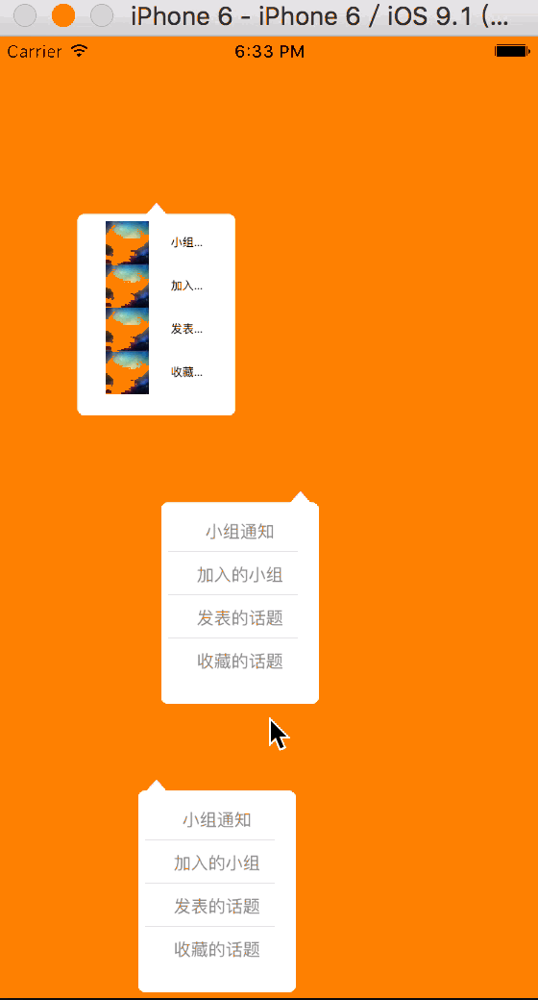

# TPCPopView
A easy way to show a popover view .<br>
You can use the following methods :<br>

```objc

[TPCPopView showMessages:self.messages withContainerSize:CGSizeMake(110, 140) fromView:self.view1 fadeDirection:TPCPopViewFadeDirectionCenter dataSource:self delegate:self];

[TPCPopView showMessages:self.messages withContainerSize:CGSizeMake(110, 140) fromView:self.view2 fadeDirection:TPCPopViewFadeDirectionRightTop clickActionBlock:^(NSInteger row) {
        NSLog(@"%ld", row);
}];

[TPCPopView showMessages:self.messages withContainerSize:CGSizeMake(110, 140) fromView:self.view3 fadeDirection:TPCPopViewFadeDirectionLeftTop clickActionBlock:^(NSInteger row) {
        NSLog(@"%ld", row);
}];
```


